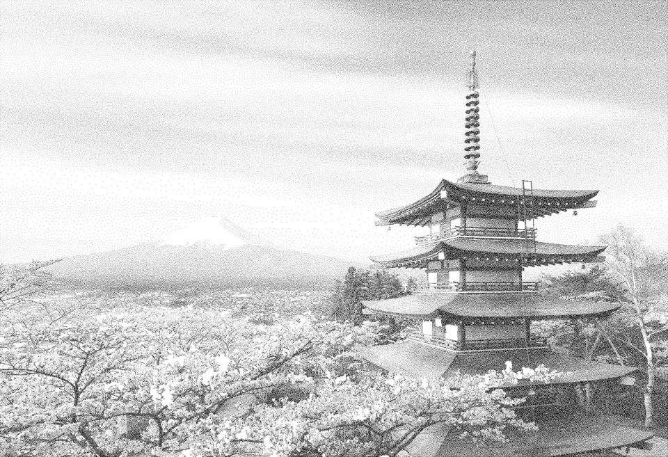
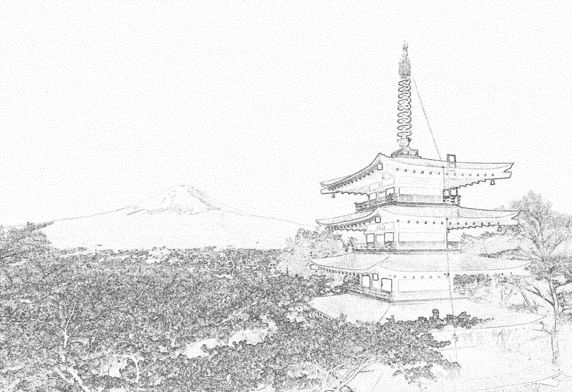
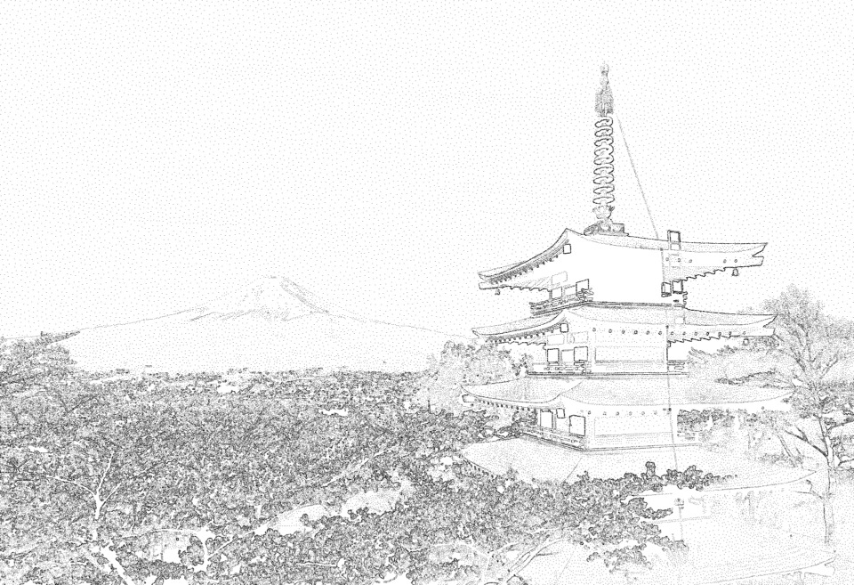
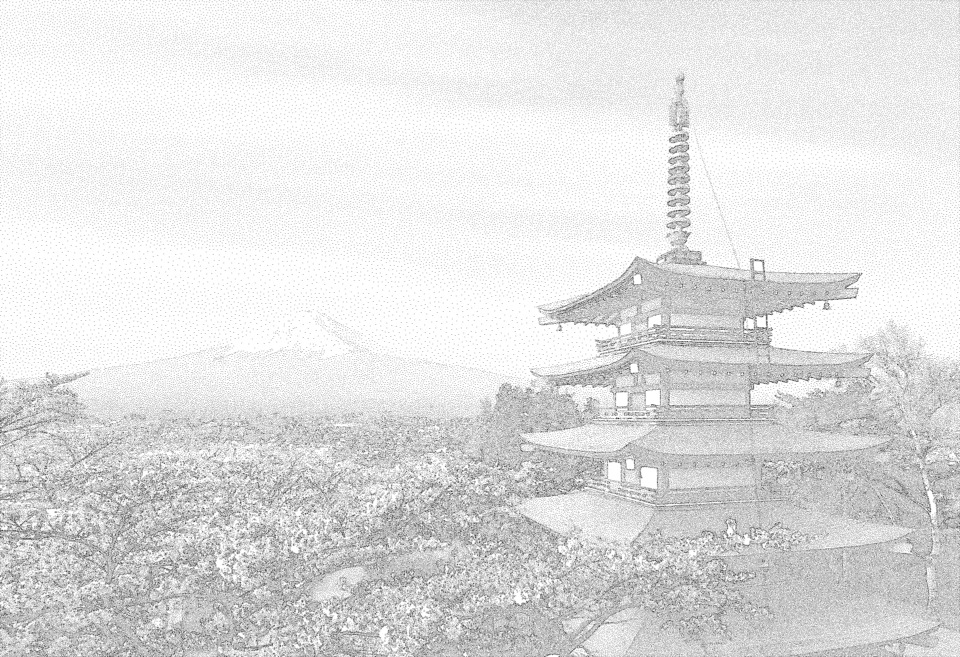

# Rust Poisson Disk Image Renderer

A high-performance Rust library for generating artistic image representations using Poisson Disk Sampling. Transform any image into a high-density stippled drawing or a geometric Voronoi mosaic.

## 🚀 Quick Start

Run the script via Cargo:

```{bash}
cargo run --release -- [args]
```

Or build and run executable:

```{bash}
cargo build --release

# Windows
./target/release/poisson-disk.exe [args]
# Linux/Mac
./target/release/poisson-disk [args]
```

See [CLI Parameters](#cli-parameters) section for full list of available [args].

## 🛠 Features

### Sampling Methods

Both methods utilize a grid to optimize spatial sampling. We set each grid cell size to $\frac{r_{min}}{\sqrt{2}}$ to ensure that each cell contains at most one point (diagonal is exactly $r_{min}$). By doing so, we reduce the validation of a new point based on the radii overlap with existing points to a simple $O(1)$ local neighbor check.
1. **Optimized Dart Throwing:** Samples points over the grid by looping through cells in a random (Fisher-Yates) order. This “controlled random” approach ensures we attempt to fill every area of the image systematically but unpredictably. It provides the same visual distribution as brute-force dart throwing sampling but converges significantly faster.
2. **Multi-Seed Bridson:** Initializes with 20 random seeds and selects new candidates by sampling in an $[r,2r]$ annulus around the active list of valid points. This method is extremely fast for high-density area but can struggle on low-density ones (the annulus being too restrictive too reach next valid candidates). The multi-seed initialization helps reduce the risk of “propagation death,” which can occur when the list of active points becomes stuck in a high-density area or at the edge of the image.

### Density Signals

- **Luma:** Inverted luminance. Dark areas result in higher point density (smaller radius).
- **Sobel:** Edge magnitude. Points cluster around high-contrast edges.
- **Blend:** A weighted mix of Sobel and Luma:

$$
\text{Blend} = \alpha\cdot \text{Sobel} + (1-\alpha)\cdot\text{Luma}\\;,\\;\alpha\in[0,1]
$$

### Rendering Modes

- **Stippling:** Pure point-cloud rendering. Points are drawn as black dots on a white canvas.
- **Vornoi:** Computes a Voronoi mosaic using the Jump Flooding Algorithm (JFA). By default, this uses a 2x coarser grid than stippling to balance performance and geometric aesthetics.

## ⚙️ Advanced Configuration

### Auto-Scaling Logic

The library automatically scales the minimum radius ($r_{min}$​) based on the image's long edge (referenced at 1080p/1920px):

$$
r_{min} = \text{ref\\_r\\_min} \times \frac{\max(W, H)}{1920} \times \text{coarseness}
$$
- **Stippling Reference:** 1.0px
- **Voronoi Reference:** 2.0px
- **R_MIN_FLOOR:** 0.5px (Prevents memory exhaustion on ultra-high resolutions).

### CLI Parameters

| Parameter | Type | Description | Default |
| :--- | :--- | :--- | :--- |
| `path_to_image` | Position | Path to the source image (JPEG/PNG) | *Required* |
| `--output-dir` | `PathBuf` | Directory to save results | *Folder of input image* |
| `--method` | `1 \| 2` | `1`: Optimized Dart Throwing, `2`: Bridson Sampling | `2` |
| `--coarseness` | `f32` | Scaling factor for the sampling grid (>0) | `1.0` |
| `--k` | `u32` | Maximum candidate attempts per iteration | `100` |
| `--seed` | `u64` | RNG seed for deterministic output | `None` |
| `--density` | `String` | `luma` (brightness), `sobel` (edges), or `blend` | `luma` |
| `--blend-alpha` | `f32` | Weight of Sobel in blend mode (0.0 to 1.0) | `0.5` |
| `--render-mode` | `String` | `stippling` (dots) or `voronoi` (mosaic) | `stippling` |
| `--frames` | `u32` | Number of frames for GIF generation | `30` |
| `--gif-duration`| `u32` | Total GIF duration in ms | `6000` |
| `--gif-pause` | `u32` | Pause at the end of the GIF in ms | `2000` |
| `--gif-scale` | `f32` | Downscale factor for the GIF output | `1.0` |
| `--png-scale` | `f32` | Downscale factor for the final PNG image | `1.0` |

## 📊 Performance & Visual Comparison

Here's a quick look at how the different algorithms sample points across the canvas and perform rendering.\
Note that all following results were generated using default parameters.

<table style="width: 100%; table-layout: fixed;">
    <thead>
        <tr align="center">
            <th><b>Input Image</b></th>
            <th><b>Dart Throwing + Sobel + Stippling</b></th>
            <th><b>Multi-Seed Bridson + Blend + Voronoi</b></th>
        </tr>
    </thead>
    <tbody>
        <tr>
            <td width="33.3%">
                
            </td>
            <td width="33.3%">
                
            </td>
            <td width="33.3%">
                
            </td>
        </tr>
    </tbody>
</table>

### Stippling

The following table illustrates results in stippling mode. While both sampling methods produce similar visual results, **Bridson** tends to struggle with the sparse areas between high-contrast contours in **Sobel** mode (visible in the upper pagoda section).

<table style="width: 100%; table-layout: fixed;">
    <thead>
        <tr align="center">
            <th><code>luma</code></th>
            <th><code>sobel (Dart Throwing)</code></th>
            <th><code>sobel (Bridson)</code></th>
            <th><code>blend</code></th>
        </tr>
    </thead>
    <tbody>
        <tr>
            <td></td>
            <td></td>
            <td></td>
            <td></td>
        </tr>
        <tr align="center" style="font-size: 1em; vertical-align: middle;">
            <td><b>Bridson:</b> ~480k pts (8s)</td>
            <td>--</td>
            <td><b>Bridson:</b> ~230k pts (5s)</td>
            <td><b>Bridson:</b> ~300k pts (6s)</td>
        </tr>
        <tr align="center" style="font-size: 1em; vertical-align: middle;">
            <td><b>Dart:</b> ~500k pts (80s)</td>
            <td><b>Dart:</b> ~250k pts (150s)</td>
            <td>--</td>
            <td><b>Dart:</b> ~320k pts (70s)</td>
        </tr>
    </tbody>
</table>

### Voronoi

The final Voronoi mosaic maintains structural consistency regardless of the sampling method. However, due to the **default 2x coarser grid**, the total number of sampled points (and therefore the sampling time) is reduced by ~3-4x compared to stippling.

* **Sampling:** Significantly faster due to lower point density.
* **Rendering:** Uses the Jump Flooding Algorithm (JFA). While JFA is fast for a single PNG, generating high-frame-rate GIFs involves running the pass for every snapshot, which scales with the `--frames` parameter.
